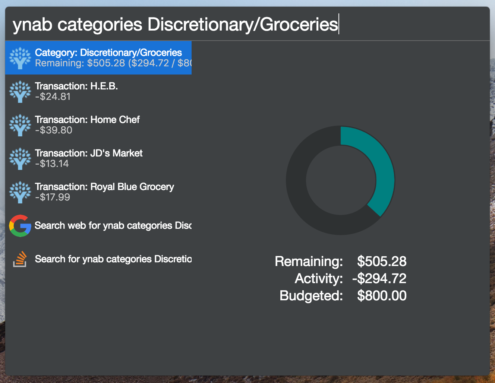

# cerebro-ynab

> [Cerebro](https://cerebroapp.com) plugin to interact with YNAB.

## Usage

In Cerebro, type `ynab` and one of the supported subcommands to get a quick view of your YNAB status.

### Supported Subcommands

- `ynab categories` - lists categories along with budgeted amounts
  - may filter by name
  - when a single category is filtered, all transactions for that category will be listed
- `ynab accounts` - lists all accounts along with current balances
  - may filter by name
  - when a single account is filtered, all transactions for that category will be listed
- `ynab transactions` - lists all transactions

### Notes

- Currently, only the first "Budget" will be used to display values.
- Accounts are listed with budget-related ones first (may not respect order in app)
- All Transactions are ordered by date in descending order (newest first) from the beginning of the current month.

## Installing

- Type `plugins ynab` into Cerebro
- Click `install`
- Follow procedure in [Obtaining Personal Access Token](./docs/obtaining-token.md) to setup plugin

## Related

- [Cerebro](http://github.com/KELiON/cerebro) – main repo for Cerebro app;
- [YNAB](https://www.youneedabudget.com/) – YouNeedABudget app;

## License

MIT © [Matthew Jacobs](https://www.matthewjacobs.io)
