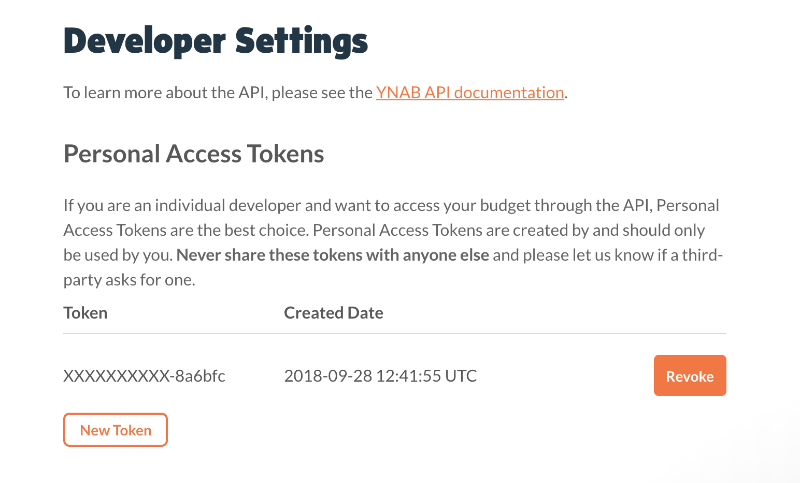

# Obtaining Personal Access Token

Due to the architecture of the `cerebro` app and this plugin, as well as the way YNAB authentication works, the best way to authenticate this plugin with YNAB is via a Personal Access Token generated by you via the YNAB app.
Follow the steps below to do so.

## Requirements

- First you will need a YNAB Account

## Steps

1. Login to YNAB
2. Go to **My Account** by clicking on your email in the bottom left corner.

- https://app.youneedabudget.com/settings

3. Scroll down and click on the **Developer Settings** button.

- https://app.youneedabudget.com/settings/developer

4. Click on **New Token**
5. Insert your password to generate a new Access Token.

- If you login via Google you will need to set a password: https://app.youneedabudget.com/users/forgot

6. Once you click on **Generate** a token will be exposed at the top of the page. Make sure to complete this process before closing the window.

---

7. Open `cerebro` and type `plugins ynab`, then click over to settings.
8. Copy the token from YNAB into the `Access Token` setting.
9. Insert `ynab` into `cerebro` to verify that the plugin is working.
